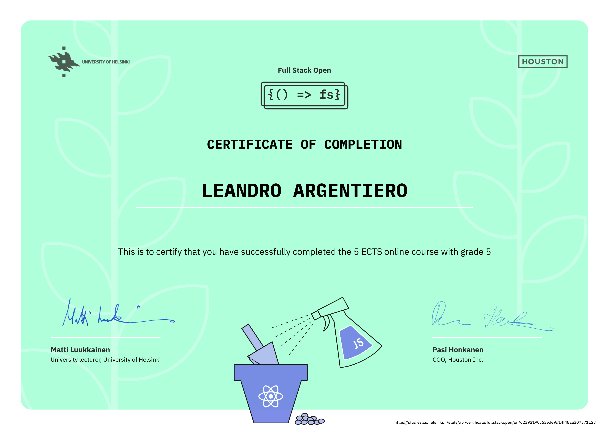

## [Full Stack Open](https://fullstackopen.com/en/)

This course is held at the Department of Computer Science at the University of Helsinki and serves as an introduction to modern web application development with JavaScript. The main focus is on building single page applications with ReactJS that use REST APIs built with Node.js.

| Part                                                  | Status |
| ----------------------------------------------------- | ------ |
| Part 0 - Fundamentals of Web Apps                     | ✅     |
| Part 1 - Introduction to React                        | ✅     |
| Part 2 - Communicating with server                    | ✅     |
| Part 3 - Programming a server with NodeJS and Express | ✅     |
| Part 4 - Testing Express servers, user administration | ✅     |
| Part 5 - Testing React apps                           | ✅     |
| Part 6 - State management with Redux                  | ✅     |
| Part 8 - GraphQL                                      |        |
| Part 9 - TypeScript                                   |        |
| Part 10 - React Native                                |        |
